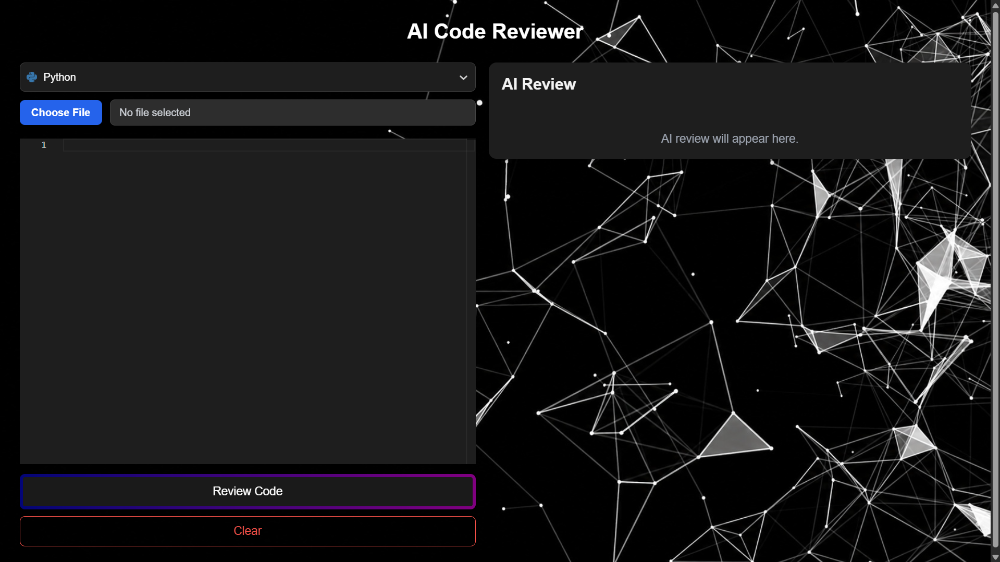
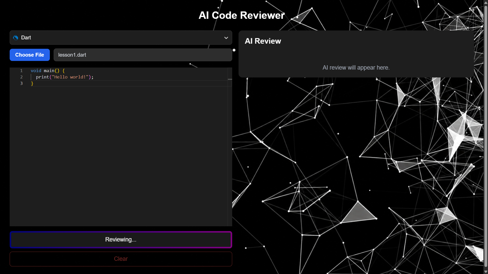
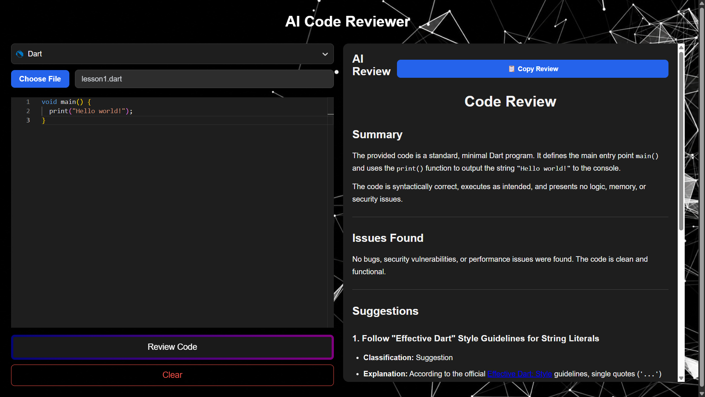

# 🤖 AI Code Reviewer


An AI-powered web application that analyzes source code using **Google Gemini AI** and provides detailed code reviews, improvement suggestions, bug detection, and optimized code examples.

Users can write code directly in the editor or upload source code files, choose the programming language, and receive a professional AI-generated review in seconds.

---

# 🌐 Live Demo

### Frontend

https://ai-code-reviewer-rho-bay.vercel.app

### Backend API

https://ai-code-reviewer-api-rr1y.onrender.com

---

# ✨ Features

- 🤖 AI-powered code review
- 💻 Monaco Code Editor
- 📂 Upload source code files
- 🌐 Supports multiple programming languages
- 📝 Markdown formatted AI responses
- 🎨 Syntax highlighting
- 📋 Copy review to clipboard
- ⚡ FastAPI REST API
- ⚛️ React + TypeScript frontend
- ☁️ Deployed on Vercel & Render
- 🔒 Environment variable configuration

---

# 📸 Screenshots

## Main Interface



---

## Upload Code



---

## AI Review



---

## Mobile Version


---

# 🛠 Tech Stack

## Frontend

- React
- TypeScript
- Vite
- Monaco Editor
- React Markdown
- Highlight.js

## Backend

- Python
- FastAPI
- Google Gemini API
- Pydantic

## Deployment

- Vercel
- Render

## Version Control

- Git
- GitHub

---

# 📂 Project Structure

```
AI-Code-Reviewer
│
├── assets
│   ├── home.png
│   ├── upload.png
│   ├── review.png
│   └── mobile.png
│
├── backend
│   ├── ai.py
│   ├── main.py
│   ├── prompt.py
│   ├── requirements.txt
│   └── .env.example
│
├── frontend
│   ├── public
│   ├── src
│   │   ├── components
│   │   ├── services
│   │   ├── App.tsx
│   │   └── main.tsx
│   ├── package.json
│   └── .env.example
│
└── README.md
```

---

# 🚀 Installation

## Clone the repository

```bash
git clone https://github.com/Timtopgg/AI-Code-Reviewer.git

cd AI-Code-Reviewer
```

---

## Backend

```bash
cd backend

pip install -r requirements.txt

python -m uvicorn main:app --reload
```

---

## Frontend

```bash
cd frontend

npm install

npm run dev
```

---

# 🔑 Environment Variables

## Backend

Create a `.env` file inside the `backend` folder.

```env
GEMINI_API_KEY=your_api_key
```

---

## Frontend

Create a `.env` file inside the `frontend` folder.

### Local development

```env
VITE_API_URL=http://127.0.0.1:8000
```

### Production

```env
VITE_API_URL=https://ai-code-reviewer-api-rr1y.onrender.com
```

---

# 📡 API

## Review Code

**POST**

```
/review
```

### Request

```json
{
  "code": "print('Hello World')",
  "language": "python"
}
```

### Response

```json
{
  "review": "AI generated review..."
}
```

---

# 📌 Future Improvements

- User authentication
- Review history
- Export review as PDF
- Multiple AI model support
- Docker support
- Dark / Light theme switch
- Review score
- Download review as Markdown

---

# 👨‍💻 Author

**Tymur Svyrydenko**

GitHub:

https://github.com/Timtopgg

---

⭐ If you found this project useful, consider giving it a star on GitHub!